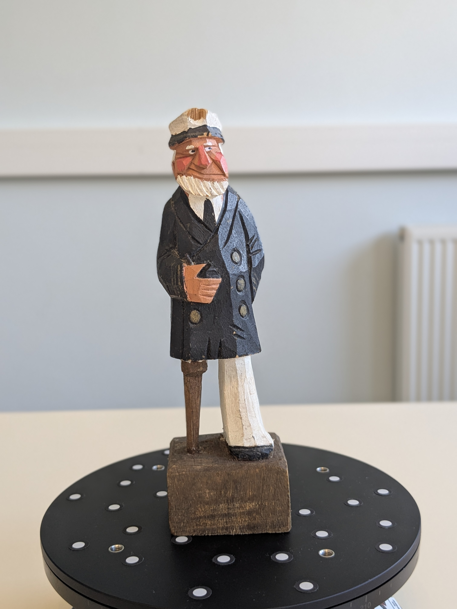
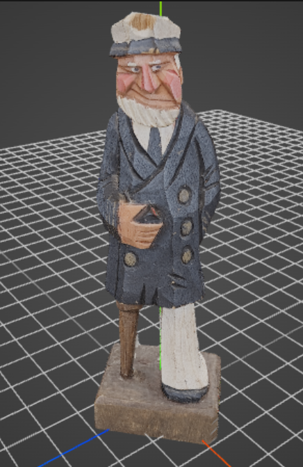

::: {.column-page-inset}

:::
---

:::: {.columns}

::: {.column width="60%"}
### Description de l'approche :
Ce projet a pour objectif la reconstruction 3D d'une figurine de marin à partir d'une série de photos.

La prise de vue a été réalisée avec un smartphone (Google Pixel 6a), produisant environ 150 images. La capture a été effectuée à l'aide d'un plateau tournant. Dans cette configuration, le fond blanc uni empêche l'algorithme de photogrammétrie (*Structure from motion*) d'extraire des points de repère sur le mur. Cela garantit une estimation de pose correcte, en forçant le calcul 3D uniquement sur la figurine en rotation.

La génération du maillage dans RealityScan a convergé rapidement grâce à la régularité de la prise de vue.

[Voir le code source sur GitHub](https://github.com/votre_lien)
:::

::: {.column width="40%"}
### Technologies :

*   **Acquisition** : appareil photo (Pixel 6a) / Plateau tournant
*   **Reconstruction** : RealityScan
*   **Orientation** : Blender (axe Y vers le haut)
*   **Affichage web** : Three.js
:::

::::

---

## Post-traitement

Le post-traitement s'est déroulé en deux étapes :

1. **Nettoyage** : suppression directe dans RealityScan des artefacts générés par le fond blanc.
2. **Orientation** : utilisation de Blender uniquement pour orienter l'objet (axe Y vers le haut) afin qu'il s'affiche avec le bon alignement dans Three.js.

### Comparaison : réel vs modèle 3D
::: {layout-ncol=2}

{.comparaison-img}

{.comparaison-img}

:::

<style>
  .comparaison-img {
    height: 400px;      
    object-fit: cover; 
    width: 100%;        
    border-radius: 4px;
  }
</style